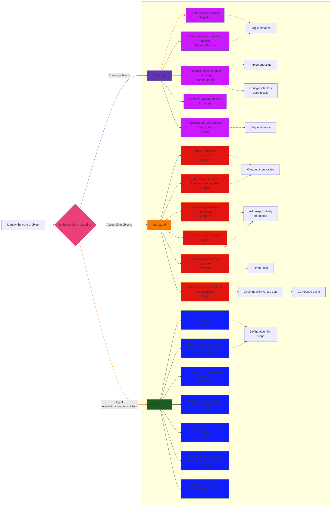
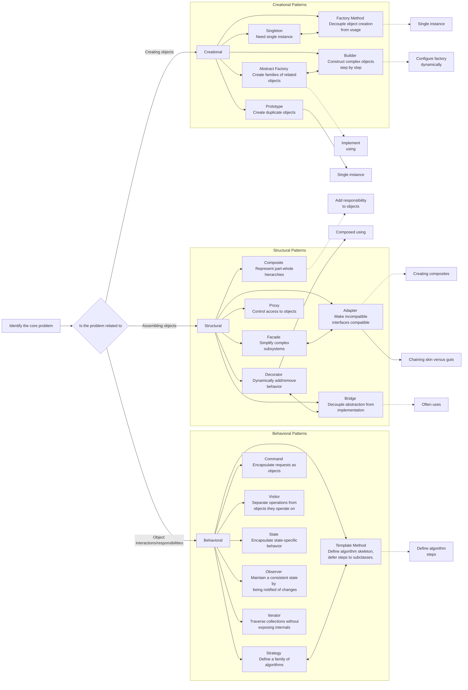

---
{"created":"2024-11-05 05:01:39","author":"Cong Le","version":"1.0","license(s)":"MIT, CC BY 4.0","dg-publish":true,"dg-home":true,"id":"01JG6GJADDMYC3XNV88TT19PBZ","permalink":"/connecting-design-patterns/","tags":["gardenEntry"],"dgPassFrontmatter":true,"noteIcon":""}
---

# Connecting Design Patterns in iOS Development - Style 1

---

# Connecting Design Patterns in iOS Development - Style 2

---

# Connecting Design Patterns in iOS Development - Style 3

```mermaid
graph LR
    A[Identify the core<br>problem] --> B{Is the<br>problem<br>related to};
    B -- Creating objects --> C(Creational);
    B -- Assembling objects --> D(Structural);
    B -- Object interactions/<br>responsibilities --> E(Behavioral);

    subgraph " "
        direction LR
        C --> CR1[Need single instance] --> S(Singleton);
        C --> CR2[Decouple object creation from usage] --> FM(Factory Method);
        C --> CR3[Create families of related objects] --> AF(Abstract Factory);
        C --> CR4[Create duplicate objects] --> P(Prototype);
        C --> CR5[Construct complex objects step by step] --> BLD(Builder);
    end

    subgraph " "
        direction LR
        D --> ST1[Simplify complex subsystems] --> F(Facade);
        D --> ST2[Make incompatible interfaces compatible] --> AD(Adapter);
        D --> ST3[Represent part-whole hierarchies] --> CP(Composite);
        D --> ST4[Control access to objects] --> PR(Proxy);
        D --> ST5[Dynamically add/remove behavior] --> DC(Decorator);
        D --> ST6[Decouple abstraction from implementation] --> BR(Bridge);
    end
    
    subgraph " "
        direction LR
        E --> BH1[Define a family of algorithms] --> STG(Strategy)
        E --> BH2[Define algorithm skeleton,<br> defer steps to subclasses.] --> TM(Template Method)
        E --> BH3[Encapsulate requests as objects] --> CMD(Command)
        E --> BH4[Separate operations from<br>objects they operate on] --> V(Visitor)
        E --> BH5[Encapsulate state-specific behavior] --> STE(State)
        E --> BH6[Maintain a consistent state by<br>being notified of changes] --> O(Observer)
        E --> BH7[Traverse collections without<br>exposing internals] --> I(Iterator)
    end

    style CR1 fill:#1f1111,stroke:#fed7aa
    style CR2 fill:#1f1111,stroke:#fed7aa
    style CR3 fill:#1f1111,stroke:#fed7aa
    style CR4 fill:#1f1111,stroke:#fed7aa
    style CR5 fill:#1f1111,stroke:#fed7aa

    style ST1 fill:#1f1111,stroke:#fed7aa
    style ST2 fill:#1f1111,stroke:#fed7aa
    style ST3 fill:#1f1111,stroke:#fed7aa
    style ST4 fill:#1f1111,stroke:#fed7aa
    style ST5 fill:#1f1111,stroke:#fed7aa
    style ST6 fill:#1f1111,stroke:#fed7aa

    style BH1 fill:#121f91,stroke:#82b366
    style BH2 fill:#121f91,stroke:#82b366
    style BH3 fill:#121f91,stroke:#82b366
    style BH4 fill:#121f91,stroke:#82b366
    style BH5 fill:#121f91,stroke:#82b366
    style BH6 fill:#121f91,stroke:#82b366
    style BH7 fill:#121f91,stroke:#82b366

    style S fill:#e1d5,stroke:#1a73a6
    style FM fill:#e1d5,stroke:#1a73a6
    style AF fill:#e1d5,stroke:#1a73a6
    style P fill:#e1d5,stroke:#1a73a6
    style BLD fill:#e1d5,stroke:#1a73a6
    
    style F fill:#818129,stroke:#9673a6
    style AD fill:#818129,stroke:#9673a6
    style CP fill:#818129,stroke:#9673a6
    style PR fill:#818129,stroke:#9673a6
    style DC fill:#818129,stroke:#9673a6
    style BR fill:#818129,stroke:#9673a6

    style STG fill:#d51114,stroke:#82b366
    style TM fill:#d51114,stroke:#82b366
    style CMD fill:#d51114,stroke:#82b366
    style V fill:#d51114,stroke:#82b366
    style STE fill:#d51114,stroke:#82b366
    style O fill:#d51114,stroke:#82b366
    style I fill:#d51114,stroke:#82b366

    style C fill:#c111f3,stroke:#824c68
    style D fill:#623ddd,stroke:#fbbd20
    style E fill:#911297,stroke:#4d884d
    style B fill:#e91f11,stroke:#b85450
    style A fill:#4e899f,stroke:#6c8ebf

    S -.-> SI1(Single instance)
    FM -.-> SI2(Single instance)
    FM -.-> IM(Implement<br>using)
    FM -.-> CFD(Configure factory<br>dynamically)
    CFD -.-> SI3(Single instance)
    CP -.-> CC(Creating composites)

    DC -.-> AR(Add responsibility<br>to objects)
    DC -.-> OU(Often uses)
    CP -.-> CU(Composed using)
    CP --> CSSVG(Chaining skin versus guts)

    STG -.-> DAS(Define algorithm<br>steps)

```

 

---

